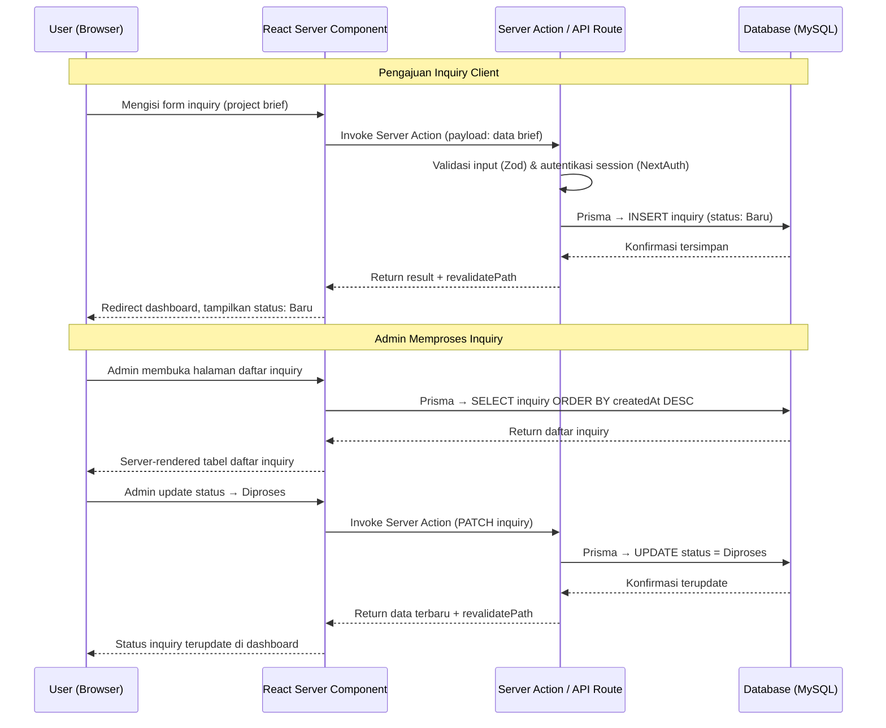
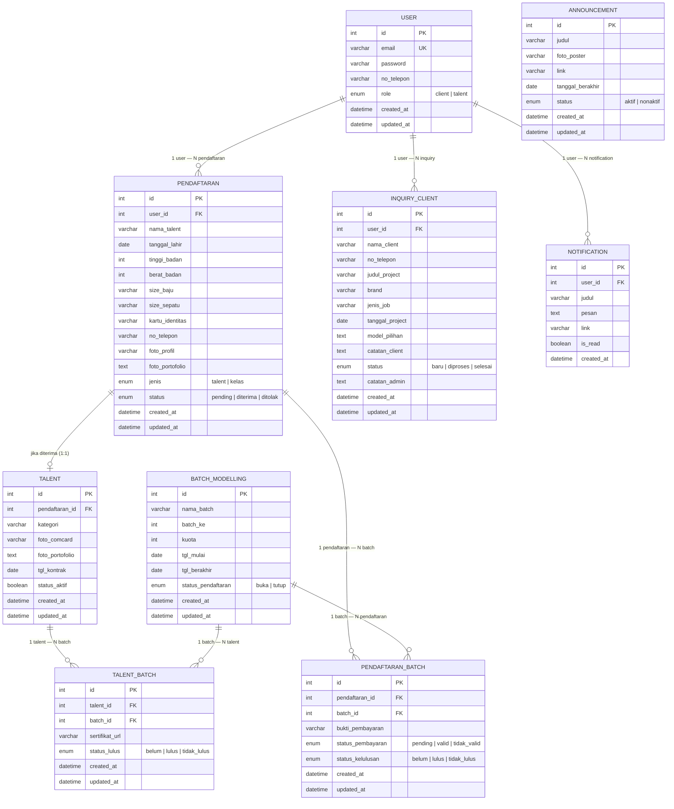

# PRD — Project Requirements Document
## Portal Manajemen Agency Modelling & Talent

---

## 1. Overview

Platform ini bertujuan untuk mendigitalkan seluruh operasional agency modelling yang sebelumnya masih dilakukan secara manual dan tersebar di berbagai platform seperti Google Form, media sosial, dan komunikasi personal via WhatsApp.

Masalah utama yang ingin diselesaikan adalah:
- Data talent tidak terpusat dan sulit dimonitor
- Proses pendaftaran talent dan kelas modelling masih manual dan tidak tertracking
- Permintaan kerja sama dari client tidak terkelola dengan baik

Tujuan utama platform adalah menyediakan sistem berbasis web yang memungkinkan **Admin** mengelola seluruh operasional agency dari satu dashboard terpusat, sementara **User** (Client dan Calon Talent) dapat berinteraksi dengan agency secara terstruktur melalui antarmuka publik yang profesional dan mencerminkan branding agency.

---

## 2. Requirements

Berikut adalah persyaratan tingkat tinggi untuk pengembangan sistem:

- **Aksesibilitas:** Aplikasi dapat diakses melalui web browser desktop maupun mobile dan harus bersifat responsif.
- **Pengguna:** Sistem memiliki dua role utama — Admin (single admin) dan User (Client / Calon Talent). Guest dapat mengakses seluruh konten publik tanpa login.
- **Autentikasi:** User melakukan registrasi mandiri dan dikategorikan berdasarkan role saat mendaftar (client atau talent). Setiap role hanya dapat mengakses fitur yang sesuai. Admin tidak dapat melakukan registrasi mandiri — akun dibuat secara internal.
- **Data Input:** Seluruh data diinput secara manual melalui form di antarmuka web.
- **Notifikasi:** Tidak ada notifikasi push eksternal. Status dapat dipantau user melalui dashboard akun masing-masing dengan indikator unread notification atau pop-up status terbaru.
- **Transaksi:** Tidak ada pembayaran online. Proses pembayaran dilakukan di luar sistem. Konfirmasi dan validasi dilakukan oleh pihak agency secara internal, dan hasilnya diperbarui melalui dashboard admin.
- **Integrasi:** Tidak ada integrasi platform eksternal.
- **Skala:** Sistem dirancang khusus untuk satu agency dan tidak mendukung multi-tenant.

---

## 3. Core Features

### 3.1 Halaman Publik (Guest & User)

**1. Landing Page & Profil Agency**
- Menampilkan identitas, branding, dan layanan agency secara visual dan profesional.
- Menampilkan pengumuman aktif seperti casting call dan pembukaan kelas modelling.

**2. Katalog Talent**
- Daftar talent aktif lengkap dengan foto, data fisik, portofolio, dan comcard.
- Fitur pencarian berdasarkan nama dan filter berdasarkan kategori talent.
- Halaman detail profil per talent.

**3. Registrasi & Login User**
- User mendaftar dengan email dan password, sekaligus memilih role (client atau talent).
- Setiap role hanya dapat mengakses fitur yang sesuai dengan tujuan pendaftarannya.
- Jika ingin menggunakan fitur di role lain, user perlu mendaftar dengan akun terpisah.

---

### 3.2 Fitur User (Setelah Login)

**4. Form Pendaftaran Talent**
- User mengisi data diri, data fisik, dan mengunggah foto serta portofolio.
- User dapat memantau status pendaftaran: **Pending → Diterima / Ditolak**.

**5. Form Pendaftaran Kelas Modelling**
- User melihat daftar batch kelas yang tersedia beserta informasi kuota dan jadwal.
- User mendaftar dengan mengisi form dan mengunggah bukti pembayaran.
- User dapat memantau status pendaftaran kelas secara real-time dari dashboard.
- User yang dinyatakan lulus oleh admin dapat mengunduh sertifikat langsung dari akun mereka.

**6. Form Inquiry Client**
- User mengisi project brief berisi informasi kebutuhan talent, jenis pekerjaan, jadwal, dan catatan tambahan.
- User dapat melihat riwayat dan memantau status inquiry: **Baru → Diproses → Selesai**.

---

### 3.3 Dashboard Admin

**7. Overview Dashboard**
- Ringkasan statistik: jumlah talent aktif, inquiry masuk, pendaftar baru, dan peserta kelas.

**8. Manajemen Konten Publik**
- Membuat, mempublikasikan, menonaktifkan, dan menghapus pengumuman.

**9. Manajemen Roster Talent**
- Tambah, edit, atur status aktif/nonaktif, dan hapus data talent.
- Talent yang diterima dari proses pendaftaran masuk ke roster dengan status nonaktif secara default, dan diaktifkan secara eksplisit oleh admin agar tampil di katalog publik.

**10. Applicant Tracking — Pendaftaran Talent**
- Meninjau data pendaftar talent secara lengkap.
- Menerima atau menolak pendaftaran.
- Pendaftar yang diterima otomatis masuk ke roster talent.

**11. Inquiry Workflow**
- Meninjau detail inquiry client.
- Memperbarui status inquiry: **Baru → Diproses → Selesai**.
- Menambahkan catatan internal per inquiry.

**12. Manajemen Batch Kelas Modelling**
- Membuat dan mengatur batch kelas beserta kuota dan jadwal.
- Menutup pendaftaran secara manual atau otomatis saat kuota penuh.
- Meninjau pendaftaran peserta beserta bukti pembayaran.
- Menentukan peserta lulus per batch.
- Mengunggah file sertifikat untuk talent yang dinyatakan lulus — sertifikat tidak digenerate otomatis oleh sistem.

---

## 4. User Flow

### Alur 1 — Kerjasama Client (End to End)

1. Admin membuat halaman info agency dan mengelola roster talent aktif → sistem mempublikasikan ke halaman publik.
2. Guest melihat katalog talent dan informasi agency.
3. Guest registrasi dan login sebagai Client.
4. Client mengisi dan mengirimkan form inquiry (project brief).
5. Sistem memvalidasi form dan menyimpan inquiry dengan status **Baru**.
6. Admin meninjau detail inquiry → memperbarui status ke **Diproses** → menambahkan catatan internal bila diperlukan.
7. Sistem memperbarui status di database → Client memantau perubahan status dari dashboard.
8. Admin memperbarui status ke **Selesai** → alur selesai.

---

### Alur 2 — Pendaftaran Talent (End to End)

1. Admin membuat announcement casting call → sistem mempublikasikan ke halaman publik.
2. Guest melihat announcement dan tertarik mendaftar.
3. Guest registrasi dan login sebagai Talent.
4. User mengisi form pendaftaran dengan data diri, data fisik, foto, dan portofolio.
5. Sistem memvalidasi dan menyimpan pendaftaran dengan status **Pending**.
6. Admin meninjau kelayakan data pendaftar → menentukan siapa yang dipanggil untuk casting/seleksi lanjutan.
7. Setelah proses seleksi selesai, admin menentukan peserta yang lolos.
8. Jika diterima: admin memperbarui status di sistem → data talent masuk roster dengan status nonaktif → admin mengaktifkan talent ke katalog publik → talent mendapat notifikasi konfirmasi diterima.
9. Jika ditolak: status pendaftaran diperbarui ke **Ditolak** → user mendapat notifikasi.

---

### Alur 3 — Kelas Modelling & Sertifikat (End to End)

1. Admin membuat batch kelas modelling dengan kuota dan jadwal → sistem mempublikasikan ke halaman publik.
2. Guest atau User melihat info batch dan ketersediaan kuota.
3. Jika kuota tersedia: User login dan mengisi form pendaftaran kelas serta mengunggah bukti pembayaran.
4. Sistem memvalidasi dan menyimpan pendaftaran dengan status **Pending**.
5. Admin memverifikasi bukti pembayaran di luar sistem.
6. Jika tidak valid: admin memperbarui status → User mendapat notifikasi untuk mengunggah ulang bukti pembayaran.
7. Jika valid: admin mengonfirmasi pendaftaran → User resmi menjadi peserta kelas.
8. Setelah kelas selesai: admin menentukan peserta lulus dan mengunggah file sertifikat yang telah disiapkan secara manual.
9. User yang lulus dapat mengunduh sertifikat dari dashboard akun mereka.

---

## 5. Architecture

### 5.1 Arsitektur Sistem

Platform ini menggunakan arsitektur **monolithic full-stack** dengan Next.js sebagai satu-satunya framework yang menangani frontend, backend (API Routes / Server Actions), dan rendering (SSR/SSG/ISR) dalam satu codebase terpadu.

```
┌─────────────────────────────────────────────────────┐
│                     Client Side                      │
│          Next.js 14+ (App Router) + TypeScript       │
│      React Server Components, Client Components      │
│          Tailwind CSS + Zustand (State Mgmt)         │
└──────────────────────┬──────────────────────────────┘
                       │ Server Actions / API Routes
┌──────────────────────▼──────────────────────────────┐
│                     Server Side                      │
│              Next.js API Routes + Server Actions     │
│       (NextAuth.js Auth, Zod Validation, Prisma)     │
└──────────────────────┬──────────────────────────────┘
                       │ Prisma ORM
┌──────────────────────▼──────────────────────────────┐
│                     Database                         │
│                      MySQL                           │
└─────────────────────────────────────────────────────┘
                       │
┌──────────────────────▼──────────────────────────────┐
│                   File Storage                       │
│          Local Disk (/public/uploads) atau            │
│          S3-Compatible (via AWS SDK)                  │
└─────────────────────────────────────────────────────┘
```

**Keunggulan arsitektur monolitik Next.js:**
- Tidak perlu mengelola dua server terpisah (frontend & backend).
- Shared types antara client dan server berkat TypeScript.
- Server Components mengurangi jumlah JavaScript yang dikirim ke client.
- Built-in optimasi performa: Image Optimization, Font Optimization, Route Prefetching.
- Deployment lebih sederhana — satu aplikasi, satu proses.

---

### 5.2 Sequence Diagram — Contoh Alur Pengajuan Inquiry



---

## 6. Database Schema

### 6.1 Entity Relationship Diagram



### 6.2 Deskripsi Tabel

| Tabel | Deskripsi |
|---|---|
| **user** | Data akun untuk autentikasi — email, password, no telepon, role |
| **pendaftaran** | Form pendaftaran talent maupun kelas modelling, dibedakan dengan kolom `jenis` |
| **talent** | Roster talent aktif yang tampil di katalog publik, lahir dari pendaftaran yang diterima |
| **batch_modelling** | Data batch kelas modelling beserta kuota dan jadwal |
| **pendaftaran_batch** | Tabel junction N:N antara pendaftaran dan batch — menyimpan bukti pembayaran dan status kelulusan per periode |
| **talent_batch** | Tabel junction N:N antara talent dan batch — menyimpan status lulus dan file sertifikat per talent per batch |
| **inquiry_client** | Permintaan kerja sama dari client dalam format project brief |
| **announcement** | Pengumuman publik yang dibuat admin — casting call, pembukaan kelas, dll |
| **notification** | Notifikasi internal per user untuk perubahan status pendaftaran, inquiry, dan kelas |

---

## 7. Design & Technical Constraints

### 7.1 Tech Stack

| Komponen | Teknologi | Keterangan |
|---|---|---|
| Framework | **Next.js 14+** (App Router) | Full-stack — menangani frontend, API, dan SSR/SSG dalam satu codebase |
| Bahasa | **TypeScript** | Type safety end-to-end antara client dan server |
| Styling | **Tailwind CSS** | Utility-first CSS framework |
| UI Components | **shadcn/ui** | Komponen UI yang accessible dan customizable, built on Radix UI |
| State Management | **Zustand** | Lightweight state management — lebih ringan dari Redux untuk skala aplikasi ini |
| ORM | **Prisma** | Type-safe ORM dengan auto-generated client, migrasi database, dan schema-first approach |
| Database | **MySQL** | Relational database — mature, performant, dan widely supported |
| Autentikasi | **NextAuth.js (Auth.js)** | Session-based auth dengan Credentials Provider, built-in CSRF protection |
| Validasi | **Zod** | Runtime schema validation untuk form dan API input, terintegrasi dengan TypeScript |
| File Upload | **Local Disk** (`/public/uploads`) atau **S3-compatible** (via `@aws-sdk/client-s3`) | Fleksibel sesuai environment deployment |
| HTTP Client | **Native fetch** (built-in Next.js) | Tidak perlu Axios — Next.js extend native fetch dengan caching & revalidation |
| Form Handling | **React Hook Form + Zod resolver** | Performant form handling dengan validasi terintegrasi |
| Image Optimization | **next/image** | Built-in lazy loading, responsive sizing, dan format optimization |
| Server Lokal | **Node.js 18+** | Cukup Node.js saja — tidak perlu PHP/Laragon |

### 7.2 Struktur Folder (App Router)

```
project-root/
├── prisma/
│   ├── schema.prisma          # Database schema & model definitions
│   └── seed.ts                # Seed data (admin account, dummy data)
├── public/
│   └── uploads/               # File uploads (foto, portofolio, sertifikat)
├── src/
│   ├── app/
│   │   ├── (public)/          # Route group: halaman publik (landing, katalog)
│   │   │   ├── page.tsx       # Landing page
│   │   │   ├── talent/        # Katalog talent & detail profil
│   │   │   └── announcement/  # Daftar pengumuman
│   │   ├── (auth)/            # Route group: login & register
│   │   │   ├── login/
│   │   │   └── register/
│   │   ├── dashboard/         # Route group: halaman user (setelah login)
│   │   │   ├── layout.tsx     # Shared layout dengan sidebar/nav
│   │   │   ├── page.tsx       # Dashboard overview user
│   │   │   ├── pendaftaran/   # Form & status pendaftaran talent
│   │   │   ├── kelas/         # Pendaftaran kelas modelling
│   │   │   ├── inquiry/       # Form & riwayat inquiry (client)
│   │   │   └── notifikasi/    # Daftar notifikasi user
│   │   ├── admin/             # Route group: dashboard admin
│   │   │   ├── layout.tsx     # Admin layout dengan sidebar
│   │   │   ├── page.tsx       # Admin overview (statistik)
│   │   │   ├── talent/        # Manajemen roster talent
│   │   │   ├── applicant/     # Applicant tracking
│   │   │   ├── inquiry/       # Inquiry workflow
│   │   │   ├── batch/         # Manajemen batch kelas
│   │   │   └── announcement/  # Manajemen pengumuman
│   │   ├── api/               # API Routes (jika diperlukan)
│   │   │   ├── auth/[...nextauth]/  # NextAuth handler
│   │   │   └── upload/        # File upload endpoint
│   │   ├── layout.tsx         # Root layout
│   │   └── globals.css        # Tailwind imports & custom styles
│   ├── components/
│   │   ├── ui/                # shadcn/ui components
│   │   ├── forms/             # Reusable form components
│   │   ├── layout/            # Header, Footer, Sidebar, Navbar
│   │   └── shared/            # Komponen umum (StatusBadge, SearchBar, dll)
│   ├── lib/
│   │   ├── prisma.ts          # Prisma client singleton
│   │   ├── auth.ts            # NextAuth config
│   │   ├── utils.ts           # Helper functions
│   │   └── upload.ts          # File upload helpers
│   ├── actions/               # Server Actions
│   │   ├── auth.ts            # Login, register, logout
│   │   ├── talent.ts          # CRUD talent & pendaftaran
│   │   ├── inquiry.ts         # CRUD inquiry
│   │   ├── batch.ts           # CRUD batch & pendaftaran kelas
│   │   ├── announcement.ts    # CRUD announcement
│   │   └── notification.ts    # CRUD notification
│   ├── schemas/               # Zod validation schemas
│   │   ├── auth.ts
│   │   ├── talent.ts
│   │   ├── inquiry.ts
│   │   └── batch.ts
│   ├── types/                 # TypeScript type definitions
│   │   └── index.ts
│   └── store/                 # Zustand stores
│       └── notification.ts
├── .env                       # Environment variables
├── next.config.ts
├── tailwind.config.ts
├── tsconfig.json
└── package.json
```

### 7.3 Batasan Sistem

- Tidak ada fitur pembayaran online
- Tidak ada live chat
- Tidak ada integrasi platform eksternal
- Sistem hanya untuk satu agency, tidak mendukung multi-tenant
- Tidak ada registrasi admin mandiri — akun admin dibuat secara internal (via database seed)
- Sistem tidak menangani kontrak, penggajian, atau urusan legal talent
- Sertifikat tidak digenerate otomatis oleh sistem — admin mengunggah file yang telah disiapkan secara manual

### 7.4 Panduan Desain

- Antarmuka publik dirancang **modern, clean, dan minimal** mengacu pada referensi visual agency fashion profesional — tidak transaksional, tidak ramai, dan user-friendly
- Tipografi judul menggunakan huruf kapital penuh (*all caps*) dengan font **PP Neue Montreal Bold** atau alternatif serupa seperti **Clash Display** atau **Satoshi Bold**
- Palet warna mengutamakan nuansa netral — hitam, putih, abu — dengan aksen minimal
- Antarmuka dashboard dirancang **efisien dan fungsional** untuk mendukung kebutuhan operasional admin sehari-hari
- Sistem harus responsif dan dapat diakses melalui browser desktop maupun mobile

---

## 8. Prisma Schema Reference

Berikut adalah referensi schema Prisma yang merepresentasikan seluruh tabel database:

```prisma
generator client {
  provider = "prisma-client-js"
}

datasource db {
  provider = "mysql"
  url      = env("DATABASE_URL")
}

enum Role {
  client
  talent
  admin
}

enum StatusPendaftaran {
  pending
  diterima
  ditolak
}

enum JenisPendaftaran {
  talent
  kelas
}

enum StatusInquiry {
  baru
  diproses
  selesai
}

enum StatusBatch {
  buka
  tutup
}

enum StatusPembayaran {
  pending
  valid
  tidak_valid
}

enum StatusKelulusan {
  belum
  lulus
  tidak_lulus
}

enum StatusAnnouncement {
  aktif
  nonaktif
}

model User {
  id          Int       @id @default(autoincrement())
  email       String    @unique
  password    String
  noTelepon   String    @map("no_telepon")
  role        Role
  createdAt   DateTime  @default(now()) @map("created_at")
  updatedAt   DateTime  @updatedAt @map("updated_at")

  pendaftaran    Pendaftaran[]
  inquiries      InquiryClient[]
  notifications  Notification[]

  @@map("user")
}

model Pendaftaran {
  id              Int                 @id @default(autoincrement())
  userId          Int                 @map("user_id")
  namaTalent      String              @map("nama_talent")
  tanggalLahir    DateTime            @map("tanggal_lahir") @db.Date
  tinggiBadan     Int                 @map("tinggi_badan")
  beratBadan      Int                 @map("berat_badan")
  sizeBaju        String              @map("size_baju")
  sizeSepatu      String              @map("size_sepatu")
  kartuIdentitas  String              @map("kartu_identitas")
  noTelepon       String              @map("no_telepon")
  fotoProfil      String              @map("foto_profil")
  fotoPortofolio  String?             @map("foto_portofolio") @db.Text
  jenis           JenisPendaftaran
  status          StatusPendaftaran   @default(pending)
  createdAt       DateTime            @default(now()) @map("created_at")
  updatedAt       DateTime            @updatedAt @map("updated_at")

  user              User                @relation(fields: [userId], references: [id])
  talent            Talent?
  pendaftaranBatch  PendaftaranBatch[]

  @@map("pendaftaran")
}

model Talent {
  id              Int       @id @default(autoincrement())
  pendaftaranId   Int       @unique @map("pendaftaran_id")
  kategori        String
  fotoComcard     String?   @map("foto_comcard")
  fotoPortofolio  String?   @map("foto_portofolio") @db.Text
  tglKontrak      DateTime? @map("tgl_kontrak") @db.Date
  statusAktif     Boolean   @default(false) @map("status_aktif")
  createdAt       DateTime  @default(now()) @map("created_at")
  updatedAt       DateTime  @updatedAt @map("updated_at")

  pendaftaran   Pendaftaran   @relation(fields: [pendaftaranId], references: [id])
  talentBatch   TalentBatch[]

  @@map("talent")
}

model BatchModelling {
  id                  Int         @id @default(autoincrement())
  namaBatch           String      @map("nama_batch")
  batchKe             Int         @map("batch_ke")
  kuota               Int
  tglMulai            DateTime    @map("tgl_mulai") @db.Date
  tglBerakhir         DateTime    @map("tgl_berakhir") @db.Date
  statusPendaftaran   StatusBatch @default(buka) @map("status_pendaftaran")
  createdAt           DateTime    @default(now()) @map("created_at")
  updatedAt           DateTime    @updatedAt @map("updated_at")

  pendaftaranBatch  PendaftaranBatch[]
  talentBatch       TalentBatch[]

  @@map("batch_modelling")
}

model PendaftaranBatch {
  id                Int               @id @default(autoincrement())
  pendaftaranId     Int               @map("pendaftaran_id")
  batchId           Int               @map("batch_id")
  buktiPembayaran   String?           @map("bukti_pembayaran")
  statusPembayaran  StatusPembayaran  @default(pending) @map("status_pembayaran")
  statusKelulusan   StatusKelulusan   @default(belum) @map("status_kelulusan")
  createdAt         DateTime          @default(now()) @map("created_at")
  updatedAt         DateTime          @updatedAt @map("updated_at")

  pendaftaran     Pendaftaran     @relation(fields: [pendaftaranId], references: [id])
  batchModelling  BatchModelling  @relation(fields: [batchId], references: [id])

  @@map("pendaftaran_batch")
}

model TalentBatch {
  id              Int               @id @default(autoincrement())
  talentId        Int               @map("talent_id")
  batchId         Int               @map("batch_id")
  sertifikatUrl   String?           @map("sertifikat_url")
  statusLulus     StatusKelulusan   @default(belum) @map("status_lulus")
  createdAt       DateTime          @default(now()) @map("created_at")
  updatedAt       DateTime          @updatedAt @map("updated_at")

  talent          Talent          @relation(fields: [talentId], references: [id])
  batchModelling  BatchModelling  @relation(fields: [batchId], references: [id])

  @@map("talent_batch")
}

model InquiryClient {
  id              Int           @id @default(autoincrement())
  userId          Int           @map("user_id")
  namaClient      String        @map("nama_client")
  noTelepon       String        @map("no_telepon")
  judulProject    String        @map("judul_project")
  brand           String?
  jenisJob        String        @map("jenis_job")
  tanggalProject  DateTime?     @map("tanggal_project") @db.Date
  modelPilihan    String?       @map("model_pilihan") @db.Text
  catatanClient   String?       @map("catatan_client") @db.Text
  status          StatusInquiry @default(baru)
  catatanAdmin    String?       @map("catatan_admin") @db.Text
  createdAt       DateTime      @default(now()) @map("created_at")
  updatedAt       DateTime      @updatedAt @map("updated_at")

  user  User  @relation(fields: [userId], references: [id])

  @@map("inquiry_client")
}

model Announcement {
  id              Int                 @id @default(autoincrement())
  judul           String
  fotoPoster      String?             @map("foto_poster")
  link            String?
  tanggalBerakhir DateTime?           @map("tanggal_berakhir") @db.Date
  status          StatusAnnouncement  @default(aktif)
  createdAt       DateTime            @default(now()) @map("created_at")
  updatedAt       DateTime            @updatedAt @map("updated_at")

  @@map("announcement")
}

model Notification {
  id        Int       @id @default(autoincrement())
  userId    Int       @map("user_id")
  judul     String
  pesan     String    @db.Text
  link      String?
  isRead    Boolean   @default(false) @map("is_read")
  createdAt DateTime  @default(now()) @map("created_at")

  user  User  @relation(fields: [userId], references: [id])

  @@map("notification")
}
```

---

## 9. Perbandingan Tech Stack: Sebelum vs Sesudah

| Aspek | Sebelum (Decoupled) | Sesudah (Full-stack Next.js) |
|---|---|---|
| Frontend | Next.js | Next.js (tetap) |
| Backend | Next.js API Routes + Server Actions |
| Database| MySQL |
| ORM | Prisma |
| Autentikasi | NextAuth.js (session-based) |
| State Management | Zustand (lebih ringan) |
| HTTP Client | Native fetch (built-in Next.js) |
| Validasi | Zod |
| File Storage | Local disk / S3 (via AWS SDK) |
| Server Lokal | Node.js saja |
| Arsitektur | 1 codebase monolitik |
| Type Safety | End-to-end (shared types) |
